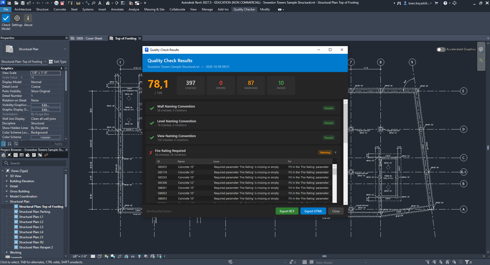
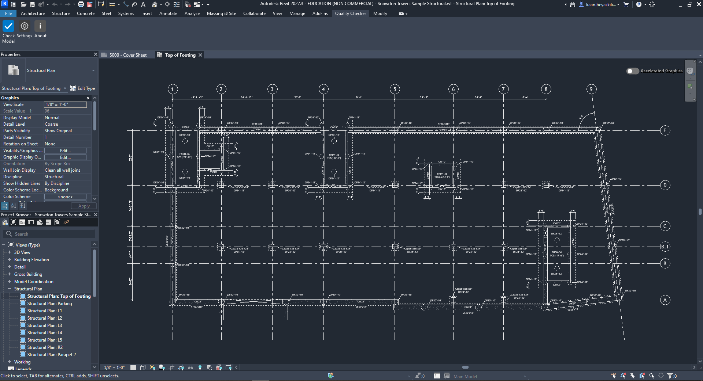
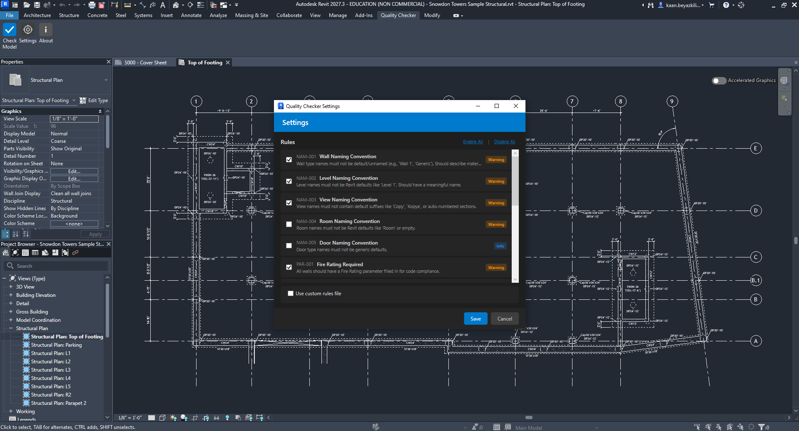
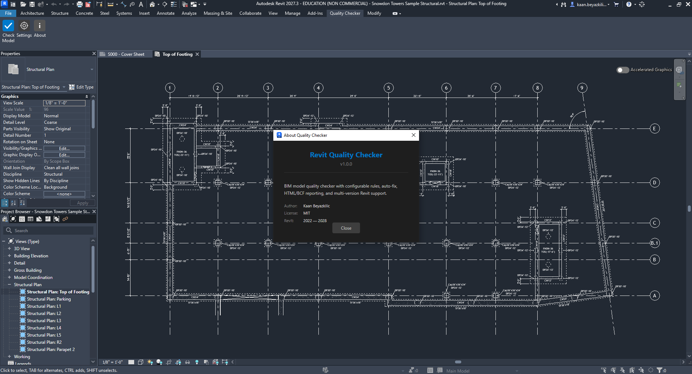

# Revit Quality Checker

Automated BIM model quality checker plugin for Autodesk Revit. Validates models against configurable rules, provides a quality score, and exports detailed reports.

Available on the [Autodesk App Store](#) | [Privacy Policy](PRIVACY.md)



## Features

- **15 Built-in Rules** across four categories: Naming Conventions, Required Parameters, Model Health, and Documentation
- **Quality Score** — 0-100 score per rule and overall, so you can track model quality over time
- **Auto-Fix** — one-click fixes for supported issues (e.g. unjoined walls)
- **HTML Report** — styled report with charts and violation tables, ready to share with your team
- **BCF Export** — BCF 2.1 format for import into Navisworks, Solibri, BIMcollab, and other coordination tools
- **Configurable Rules** — enable/disable rules or load custom JSON rule files for company standards
- **Revit 2027 Support** — built for the latest Revit platform
- **Dark Theme UI** — matches Revit's interface

## Screenshots

| Ribbon | Results | Settings | About |
|--------|---------|----------|-------|
|  |  |  |  |

## Quality Rules

| ID | Category | Rule | Severity |
|----|----------|------|----------|
| NAM-001 | Naming | Wall names are not defaults | Warning |
| NAM-002 | Naming | Level names are not defaults | Warning |
| NAM-003 | Naming | View names have no copy/default suffixes | Warning |
| NAM-004 | Naming | Room names are not defaults | Warning |
| NAM-005 | Naming | Door type names are not generic | Info |
| PAR-001 | Parameters | Walls have Fire Rating | Warning |
| PAR-002 | Parameters | Doors have Mark | Warning |
| PAR-003 | Parameters | Rooms have Number | Error |
| PAR-004 | Parameters | Windows have Mark | Warning |
| HLT-001 | Health | No duplicate view names | Warning |
| HLT-002 | Health | No unplaced/open-boundary rooms | Error |
| HLT-003 | Health | No duplicate room numbers | Error |
| HLT-004 | Health | Room tags are placed | Warning |
| HLT-005 | Health | Door tags are placed | Warning |
| HLT-006 | Health | Walls are properly joined | Warning |

## Installation

### From Autodesk App Store (Recommended)

Download from the [Autodesk App Store](#) and follow the installer instructions.

### Manual Installation

1. Download the latest release from [Releases](https://github.com/kaan36875/revit-quality-checker/releases)
2. Extract `RevitQualityChecker.bundle` to `%ProgramData%\Autodesk\ApplicationPlugins\`
3. Restart Revit

## Usage

1. Open a Revit model
2. Go to the **Quality Checker** tab on the ribbon
3. *(Optional)* Click **Settings** to enable/disable rules or load a custom rules file
4. Click **Check Model** to run the analysis
5. Review results — each rule shows pass/fail, violation count, and element details
6. Click **Fix** on supported rules to auto-fix issues
7. Click **Export HTML** or **Export BCF** to generate reports

## Building from Source

### Prerequisites

- Visual Studio 2022+ or `dotnet` CLI
- .NET 10 SDK
- Revit 2027 installed (for Revit API references)

### Build

```bash
dotnet build src/RevitAdapter -c Release
```

The post-build target automatically deploys to `%AppData%\Autodesk\Revit\Addins\2027\`.

### Run Tests

```bash
dotnet test tests/Core.Tests
```

### Create Installer Bundle

```powershell
powershell -ExecutionPolicy Bypass -File installer\build-bundle.ps1
```

Output: `installer/output/RevitQualityChecker.bundle.zip`

## Project Structure

```
src/
  Core/               # Rules engine, models, configuration (netstandard2.0)
  Reporting/           # HTML and BCF report generators (netstandard2.0)
  RevitAdapter/        # Revit plugin, WPF UI, commands (net10.0-windows)
tests/
  Core.Tests/          # Unit tests (36 tests)
rules/
  default-rules.json   # Built-in rule definitions
  ruleset-schema.json  # JSON schema for custom rules
installer/
  build-bundle.ps1     # Bundle packaging script
  PackageContents.xml  # Autodesk AppStore manifest
pyrevit/               # pyRevit MVP prototype (Python)
```

## Custom Rules

Create a JSON file following the schema in `rules/ruleset-schema.json` and load it through **Settings > Custom Rules File**. This lets you define organization-specific naming patterns, required parameters, and thresholds.

## Uninstallation

1. Delete `%ProgramData%\Autodesk\ApplicationPlugins\RevitQualityChecker.bundle\`
2. *(Optional)* Delete settings: `%AppData%\RevitQualityChecker\`

## License

[MIT](LICENSE)

## Author

**Kaan Beyazkilic** — [kaanbeyazkilic.com](https://kaanbeyazkilic.com)
